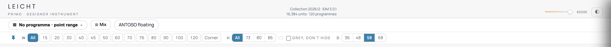
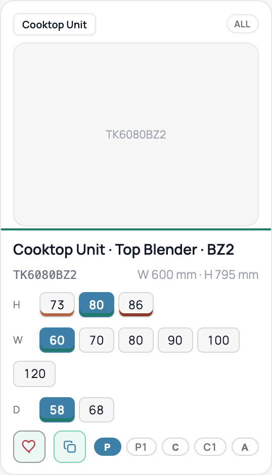
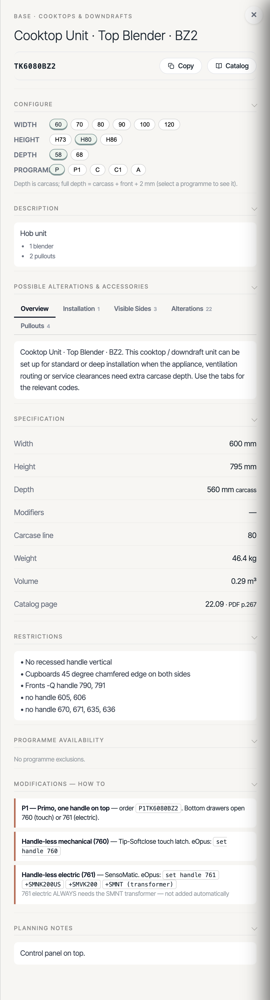
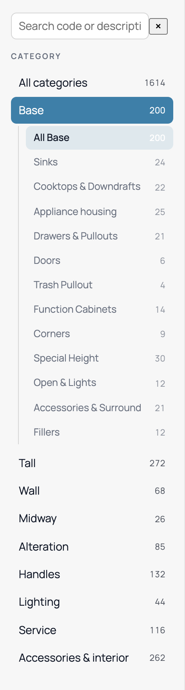

# design-book-api-ui-map.md

**API ↔ UI parameter map** — every `design-book` endpoint's parameters (request + response) mapped
side-by-side to the UI element it drives and where that element sits on screen.

- Base path: `/design-book` · all endpoints JWT-guarded (`Authorization: Bearer <token>`).
- **Dir**: `IN` = request param (query / path / body) · `OUT` = response field the UI renders.
- **UI location** uses the app vocabulary (see project `CLAUDE.md` → "UI vocabulary").
- **Sample call**: a concrete request exercising that row. `…` = `/design-book`; every call needs
  `-H "Authorization: Bearer <token>"` (omitted for brevity). IN rows show the param in use;
  OUT rows show the call whose response carries that field.
- Source: `D4K-backend/src/design-book/` (controller · service · `dto/query-items.dto.ts` · item schema)
  and the contract `docs/export-schema.ts`.

Endpoints: `POST ingest` · `GET items` · `GET items/by-section` · `GET items/:sku` · `GET programs` ·
`GET categories` · `GET functional-categories` · `GET home` · `GET meta` · `GET stats`.

---

## 1. `POST /design-book/ingest` — sync the catalog export (admin only)

| API parameter | Dir | UI parameter (element) | UI location | Sample call |
|---|---|---|---|---|
| `file` (multipart) | IN | Catalog-export upload control | Admin · Catalog import (not customer UI) | `curl -F file=@docs/export-v767.json …/ingest` |
| `summary.items` / `programmes` / `categories` | OUT | Import result counts | Admin · import result toast/log | `POST …/ingest` → `summary.items` |
| `summary.catalogVersion` / `schemaVersion` | OUT | Version line of the import | Admin · import result | `POST …/ingest` → `summary.catalogVersion` |

---

## 2. `GET /design-book/items` — grid / card list

*The grid filter bar (all in `GET items` request table below). Left→right: **PROGRAMME dropdown**
("No programme · point range" — world state, no param) · **Mix** button (UI-only) · **W** row
(`widthMm`, cm×10) · **H** row (`heightClass` 73/80/86) · **GREY, DON'T HIDE** toggle (UI-only) ·
**D** row (`depthMm`).*

### Request (filters → UI controls)

| API parameter | Dir | UI parameter (element) | UI location | Sample call |
|---|---|---|---|---|
| `page`, `limit` | IN | Grid pager | Grid footer | `…/items?page=2&limit=50` |
| `q` | IN | "Search by Code" box (free-text **partial** match on sku / name) | Landing / top search | `…/items?q=TK6080` |
| `sku[]` | IN | **Exact SKU** filter — one or more order codes (repeat or comma-separate; upper-cased; `$in`) | (precise lookup — copied ⧉ code, deep link, "my list" batch) | `…/items?sku=TK6080BZ2,TK7080BZ2` |
| `category` | IN | Category pick | Left sidebar — type taxonomy (Base / Tall / Wall / Midway …) | `…/items?category=Base` |
| `subcategory` | IN | Sub-category pick | Left sidebar — nested under category (Water / Cooling / …) | `…/items?category=Base&subcategory=Sinks` |
| `section` | IN | On-page section header | Grid section divider | `…/items?section=Cooktops` |
| `familyId` | IN | Sibling-code group | (internal — client groups cards by family) | `…/items?familyId=F333` |
| `leafId` | IN | "Design Tasks" **leaf** | Left "Design Tasks" sidebar (e.g. Water → Dishwasher Fronts) | `…/items?leafId=b_water%232` |
| `groupKey` | IN | "Design Tasks" **group** ("All Base Water") | Left "Design Tasks" sidebar — group row | `…/items?groupKey=b_water` |
| `zone` | IN | "Design Tasks" **zone** | Left "Design Tasks" sidebar — zone header (Base/Tall/Wall/Midway) | `…/items?zone=Base` |
| `kind` | IN | Item-type filter (cabinet/alteration/accessory/part) | (filter) | `…/items?kind=accessory` |
| `family` | IN | **PROGRAMME tab** (All / Primo / Avance / Contino) — maps to tiers (Primo→P/P1, Contino→C/C1, Avance→A) | Top toolbar — "PROGRAMME" tab group | `…/items?family=Contino` |
| `programs[]` | IN | **PROGRAMME picker multi-select** (array of programme ids/names; union of their tiers) | "Programme for Base units" modal (Step 1 of 4) — highlighted chips | `…/items?programs=AVENIDA&programs=BONDI-A` |
| `tier` | IN | **FRONTS pill** (P·P1·A·C·C1) | Top toolbar — "FRONTS" pill group | `…/items?tier=P1` |
| `widthMm` | IN | **W pill** (cm×10 → mm) | Grid filter bar — W row (15·20·30·…·Corner) | `…/items?widthMm=600` |
| `heightClass` | IN | **H pill** (73·80·86 — coarse bucket, not `heightMm`) | Grid filter bar — H row | `…/items?heightClass=80` |
| `depthMm` | IN | **D pill** (cm×10 → mm) | Grid filter bar — D row (36·48·58·63·68) | `…/items?depthMm=580` |
| `heightMm` | IN | Exact carcass height (mm) — not a bar pill | (precise filter) | `…/items?heightMm=792` |
| `suspended` | IN | **TOE-KICK "Suspended" toggle** (engineering `suspended`, ok=true) | Top toolbar — TOE-KICK H · Suspended | `…/items?suspended=true` |
| `active` | IN | Active-only flag | Admin | `…/items?active=true` |
| `groupBy=family` | IN | **Grid card grouping** — one card per family ("N types"); pages by family, not unit | Grid — the card grid itself (each card = a "type") | `…/items?leafId=b_cool%230&groupBy=family` |
| `full` | IN | Include full detail blobs | (dev / debug flag) | `…/items?q=T6073VE&full=true` |

> **availableTiers precedence** (one filter, most-specific wins): `tier` (FRONTS pill) → `programs[]` (picker) → `family` (tab).
> Grid is **tier-granular**: item↔programme links only by tier, so two same-tier programmes collapse to one tier.
> Bar controls that are NOT item filters (world/display state, no param): PROGRAMME dropdown ("No programme · point range"),
> TOE-KICK slider (cm), the ⇄ mm/inch converter box, "GREY, DON'T HIDE" toggle, "Mix" button, "Corner" width pill.
> Combine freely: `…/items?category=Base&heightClass=80&depthMm=580&suspended=true&tier=P&page=1&limit=50`
>
> **Grid is card = family, not unit.** Default (no `groupBy`) returns one row per UNIT (sku); the grid
> shows one card per FAMILY ("type"). Leaf `b_cool#0` = **75 units → 4 cards**; Base zone = 7208 units /
> 351 types. Use `groupBy=family` so pagination lines up with the card grid. The face (card) unit = the
> family's base-tier match (P > P1 > C > C1 > A, then smallest dims); it **follows the active `tier`
> filter** (e.g. `tier=C` → the C-tier face). `availableTiers` on a grouped card is the family-wide union
> (drives "Compatible: P · C").
>
> **Two grouping levels.** Cards (families) are additionally grouped under `section` headers ("COOKTOP
> UNITS", "COOKTOP UNIT WITH DRAWERS"). Grouped `items` come section-sorted and each carries `section` →
> the client renders a header whenever it changes. Verified: leaf `b_cook#0` = 8 families → 5 cards under
> "Cooktop Units" + 3 under "Cooktop Unit with Drawers". Caveat: **section order, card order within a
> section, and the exact face unit are best-effort** — the v767 export didn't capture the app's
> presentation order or each family's default unit (would need a re-extract; see `familyFace` / `gridOrder`
> in `export-schema.ts`).

### Response (per-card fields → card slots)

*One card (`TK6080BZ2`). Top-left = `cardLabel` ("Cooktop Unit") · top-right = `programmeBadge`
("ALL") · image area = `imageUrl` · title = `name` · `sku` + dims line (`widthMm`/`heightMm`) ·
**H/W/D** pill rows = `configure.height`/`.width`/`.depth` (filled = `selected`) · bottom-left ♥/⧉
= UI-only fav/copy · bottom-right `P · P1 · C · C1 · A` = `availableTiers` (filled = orderable).*

| API parameter | Dir | UI parameter (element) | UI location | Sample call |
|---|---|---|---|---|
| `sku` | OUT | Order code + Copy (⧉) button | Card — under title / bottom-left ⧉ | `…/items?limit=1` → `items[0].sku` |
| `name` | OUT | Card title | Card — title line | `…/items` → `items[].name` |
| `nameQualifier` | OUT | **Amber sub-label after the title** ("Mid 45 cm deep" · "Top 45 cm deep" · "Mid drawer 30 cm deep" · "loose without drill holes") | Card — right of title | `…/items?q=TSP6080BZ2` → `items[].nameQualifier` |
| `handedLR` | OUT | **"L/R" badge** (available left OR right hinged — state hinge side on order; drawing shows Left) | Card — right of title | `…/items?q=TSP6080` → `items[].handedLR` |
| `cardLabel` | OUT | Small card label | Card — **top-left** ("Front" / "Built-in DW door") | `…/items` → `items[].cardLabel` |
| `programmeBadge` | OUT | Programme summary chip | Card — **top-right** (P / ALL / P·A) | `…/items` → `items[].programmeBadge` |
| `availableTiers[]` | OUT | FRONTS tier badges | Card — **bottom-right** (P · P1 · C1) | `…/items` → `items[].availableTiers` |
| `imageUrl` | OUT | Product image (built from `meta.imageUrlTemplate`) | Card — image area | `…/items` → `items[].imageUrl` |
| `widthMm` / `heightMm` / `depthMm` | OUT | Dims line ("W 800 mm · H 792 mm") | Card — under title | `…/items` → `items[].widthMm` |
| `configure.width[]` | OUT | **W** pill row | Card — Configure rows | `…/items?full=true` → `items[].configure.width` |
| `configure.height[]` | OUT | **H** pill row (73 / 80 / 86) | Card — Configure rows | `…/items?full=true` → `items[].configure.height` |
| `configure.depth[]` | OUT | **D** pill row (incl. "63 cm alteration") | Card — Configure rows | `…/items?full=true` → `items[].configure.depth` |
| `configure.programme[]` | OUT | Programme / tier pills (P · P1 · C1) | Card — **bottom-right** | `…/items?full=true` → `items[].configure.programme` |
| `configure.optionRows[]` | OUT | Coded rows — **Ty** / Mode / Config (Z2XM · Z3M · ~~S2ZM~~) | Card — Configure rows | `…/items?full=true` → `items[].configure.optionRows` |
| `configure.optionRows[].options[].crossedOut` | OUT | Struck-through pill (exists but not orderable here) | Card — pill state (e.g. ~~S2ZM~~) | `…/items?full=true` → `…optionRows[].options[].crossedOut` |
| `configure.*[].selected` / `.available` | OUT | Highlighted vs greyed pill | Card — pill state | `…/items?full=true` → `…configure.width[].available` |
| `configure.*[].sku` | OUT | Pill target (click → opens that item) | Card — pill navigation | `…/items?full=true` → `…configure.width[].sku` |
| `appliance` | OUT | Appliances icon → **Appliances popup** (brand · category · subcategory · nicheSize) | Card — **bottom-left** (appliance fronts only) | `…/items?full=true` → `items[].appliance` |
| `sinkFitment.maxSinkSizeInch` | OUT | **"Max Sink Size: NN″" line** | Card — bottom row (Base/Sinks cards, `showOnCard`) | `…/items?q=TSP6080BZ2` → `items[].sinkFitment.maxSinkSizeInch` |
| `sinkFitment` (`cabinetWidthCm` · `customAboveInch` · `isDoor` · `notes[]`) | OUT | **"+ Add Sink" popup** — width, max bowl size, fitment rules | Card — **bottom-right** "+ Add Sink" button → popup | `…/items?full=true&q=TSP6080BZ2` → `items[].sinkFitment` |
| `types` | OUT | **"N types" count** (distinct families in the filtered set) | Grid — header ("4 types") | `…/items?leafId=b_cool%230` → `types` |
| `unitCount` | OUT | Units collapsed into the card (grouped mode only) | Card — (variant count) | `…/items?leafId=b_cool%230&groupBy=family` → `items[].unitCount` |
| `memberSkus[]` | OUT | Every code in the family (grouped mode) — resolves the card's pills | Card — Configure pill targets | `…?groupBy=family` → `items[].memberSkus` |
| `familyId` | OUT | The family the card represents (grouped mode) | Card — (grouping key) | `…?groupBy=family` → `items[].familyId` |
| `section` | OUT | **Grid section header** (cards are stacked under it) | Grid — section divider ("COOKTOP UNITS" · "COOKTOP UNIT WITH DRAWERS") | `…/items?leafId=b_cook%230&groupBy=family` → `items[].section` |
| `pagination.total` / `page` / `pages` | OUT | Pager counts (grouped: **total = family count**) | Grid footer | `…/items` → `pagination.total` |

---

## 2b. `GET /design-book/items/by-section` — grid, PRE-grouped by section header

Same grid as `GET items`, but the response is already bucketed into the on-screen **section headers**
the app stacks cards under ("APPLIANCE FRONTS · DW (CENTER HANDLE)", "FRONT FOR DISHWASHER APPLIANCES ·
ORIGINAL HANDLE D61"). Cards are **families** (same collapse as `groupBy=family`). It accepts **every**
`GET items` filter (row-for-row identical to §2 request table: `leafId` / `groupKey` / `zone` /
`category` / `subcategory` / `section` / `tier` / `family` / `programs[]` / `widthMm` / `heightClass` /
`depthMm` / `kind` / `q` / `full` / `page` / `limit`). Use it instead of `GET items?groupBy=family`
when you want the server to do the section bucketing.

### Response (envelope → UI)

| API parameter | Dir | UI parameter (element) | UI location | Sample call |
|---|---|---|---|---|
| `sections[].section` | OUT | **Section header** text | Grid — section divider | `…/items/by-section?leafId=b_water%232` → `sections[].section` |
| `sections[].count` | OUT | Cards in that section | Grid — (per-section count) | `…/items/by-section?leafId=b_water%232` → `sections[].count` |
| `sections[].cards[]` | OUT | The family cards under that header (same shape as §2 `items[]`) | Grid — cards stacked below the header | `…/items/by-section?leafId=b_water%232` → `sections[].cards` |
| `types` | OUT | **"N types" count** (total families across all sections) | Grid — header | `…/items/by-section?leafId=b_water%232` → `types` |
| `pagination.total` / `page` / `pages` | OUT | Pager (**total = family/card count**) | Grid footer | `…/items/by-section?leafId=b_water%232` → `pagination.total` |

> **Cards are families**, identical to `groupBy=family` (see §2's "card = family" + face-unit notes) —
> each `cards[]` entry carries `familyId` / `unitCount` / `memberSkus[]` / family-wide `availableTiers`.
> **Card/popup annotations flow through** (from the face unit's own item doc): `nameQualifier`,
> `handedLR`, `sinkFitment` (Max Sink Size / + Add Sink), and `appliance` (Appliances popup) all appear
> on `cards[]` where set — same shape as §2 `items[]`. Verified on `subcategory=Sinks` (18/25 cards carry
> `sinkFitment`) and `subcategory=Appliance housing` (`GFVK8073SM` → Gaggenau · Dishwashers · Built-In ADA · 24").
> **Paging is by family (card), not by section**: the page's cards are section-sorted then bucketed, so a
> section straddling a page boundary appears (partially) on **both** pages — the client merges buckets by
> `section` on scroll. Same best-effort ordering caveat as §2 (v767 export didn't capture the app's
> section / card order). Verified: `leafId=b_water#2` → 19 families → 6 section buckets ("Appliance
> Fronts · DW (center handle)" = 5 cards, "Front for Dishwasher Appliances · Original handle D61" = 3).

---

## 3. `GET /design-book/items/:sku` — detail panel (`openDetail`)

*Detail panel for `TK6080BZ2`, top→bottom = the response table below: breadcrumb + title +
**Copy**/**Catalog** buttons (header) · **CONFIGURE** (`configure`) · **DESCRIPTION**
(`description`) · **POSSIBLE ALTERATIONS & ACCESSORIES** tabs (`accessoryPanel.tabs`) ·
**SPECIFICATION** (`specification`) · **RESTRICTIONS** (`restrictions`) · **PROGRAMME
AVAILABILITY** (`programmeAvailability`) · **MODIFICATIONS — HOW TO** (`modifications`) ·
**PLANNING NOTES** (`planningNotes`).*

### Request

| API parameter | Dir | UI parameter (element) | UI location | Sample call |
|---|---|---|---|---|
| `:sku` (path) | IN | Clicked card / "Search by Code" | Grid card / top search | `…/items/TK6080BZ2` |
| `expand=refs,catalog,all` | IN | (enrichment flags) | Powers card labels/images + Catalog PDF — no visible control | `…/items/T6073VE?expand=all` |

### Response (detail sections → panel blocks, top→bottom)

| API parameter | Dir | UI parameter (element) | UI location | Sample call |
|---|---|---|---|---|
| `item.sku` / `name` | OUT | Header code + title | Detail — header | `…/items/TK6080BZ2` → `item.name` |
| `item.nameQualifier` | OUT | Amber sub-label after the title ("Mid 45 cm deep") | Detail — header, right of title | `…/items/TSP6080BZ2` → `item.nameQualifier` |
| `item.handedLR` | OUT | "L/R" badge (left OR right hinged — state hinge side on order) | Detail — header, right of title | `…/items/TSP6080` → `item.handedLR` |
| `item.toeKick` | OUT | Toe-kick installed-height | Detail — header dims | `…/items/TK6080BZ2` → `item.toeKick` |
| `item.configure` | OUT | CONFIGURE box (W/H/D/Programme + coded rows) | Detail — Configure | `…/items/TK6080BZ2` → `item.configure` |
| `item.description` | OUT | DESCRIPTION block (title + bullets) | Detail — Description | `…/items/TK6080BZ2` → `item.description` |
| `item.accessoryPanel.tabs[]` | OUT | POSSIBLE ALTERATIONS & ACCESSORIES tabs | Detail — panel tabs | `…/items/T6073VE` → `item.accessoryPanel.tabs` |
| `item.accessoryPanel…swatches` / `visibleSideCombos` / `options` | OUT | Finish-interior grid · visible-side combos · option chips | Detail — Finish/Options tabs | `…/items/T6073VE` → `…accessoryPanel.tabs[].swatches` |
| `item.relatedGroups[]` | OUT | Compatible Accessories · Planned Together · Opening Support · Complete This Cabinet | Detail — related groups | `…/items/T3073Z2W?expand=refs` → `item.relatedGroups` |
| `systems[]` | OUT | **System Builder** panel — Required/Optional component rows + "Add Complete … System" (top-level, sibling of `item`; only on trigger skus) | Detail — System Builder box | `…/items/LLERUS` → `systems` |
| `item.engineering[]` | OUT | ENGINEERING capability flags (🟢/🔴) | Detail — Engineering | `…/items/TK6080BZ2` → `item.engineering` |
| `item.specification` | OUT | SPECIFICATION (W/H/D, carcase, weight, volume, page) | Detail — Specification | `…/items/TK6080BZ2` → `item.specification` |
| `item.restrictions[]` | OUT | RESTRICTIONS | Detail — Restrictions | `…/items/TK6080BZ2` → `item.restrictions` |
| `item.programmeAvailability` | OUT | PROGRAMME AVAILABILITY | Detail — Programme availability | `…/items/TK6080BZ2` → `item.programmeAvailability` |
| `item.modifications[]` | OUT | MODIFICATIONS — how to (handle 760/761, P1/C1) | Detail — Modifications | `…/items/TK6080BZ2` → `item.modifications` |
| `item.planningNotes[]` | OUT | PLANNING NOTES | Detail — Planning notes | `…/items/TK6080BZ2` → `item.planningNotes` |
| `item.didYouKnow` | OUT | 💡 Did you know? | Detail — footer tip | `…/items/TK6080BZ2` → `item.didYouKnow` |
| `item.appliance` | OUT | **Appliances popup** — click the Appliances button; rows built from these fields | Detail / Card — Appliances popup | `…/items/GFVK8080SM` → `item.appliance` |
| `item.sinkFitment` | OUT | **Sink fitment** section + **"+ Add Sink" popup** (max bowl size · width · rules) | Detail — Sink fitment (Base/Sinks only) | `…/items/TSP6080BZ2` → `item.sinkFitment` |
| `item.finishes[]` | OUT | Finish → price | Detail — finish/pricing | `…/items/TK6080BZ2` → `item.finishes` |
| `item.imageUrl` | OUT | Main product image | Detail — header image | `…/items/TK6080BZ2` → `item.imageUrl` |
| `catalog` (expand) | OUT | CATALOG button → price-cropped PDF page | Detail — header CATALOG button | `…/items/TK6080BZ2?expand=catalog` → `catalog` |
| `refs` (expand) | OUT | Resolves each ItemRef sku → name/kind/image | Detail — all card labels/images | `…/items/T6073VE?expand=refs` → `refs` |

> **Appliances popup** (`item.appliance`, set only on the 8 housing families). The card/detail
> **Appliances** button (fridge/appliance glyph, tooltip "Appliances") opens a popup whose rows map
> **1:1** to the app's `addAppliances` payload:
> `brand` (company) · `category` (Refrigerators \| Dishwashers — also picks the icon) ·
> `subcategory` (**DW only**: Built-In \| Built-In ADA when heightClass 73) ·
> `nicheSize` (24" for DW; 18/24/30/36" for fridge, from width) ·
> `note` (**DW only**, original-handle GFVO* fronts: leg/brand fitment).
> `subcategory` + `note` are present **only** when `category === "Dishwashers"`; a fridge front carries
> just brand/category/nicheSize. Example: `GFVK8080SM` → **"Gaggenau · Dishwashers · Built-In · 24"".**
>
> **Sink fitment** (`item.sinkFitment`, set only on **Base/Sinks** cabinets with a width). Powers the card
> **"Max Sink Size: NN″"** line and the **"+ Add Sink"** popup, plus the detail **Sink fitment** section.
> All DERIVED from the cabinet width (`SINK_FIT` lookup) + whether the front is a hinged door — no separate
> record:
> `maxSinkSizeInch` (largest bowl for this width; **null** = compact base <45 cm → confirm manually) ·
> `cabinetWidthCm` (the width it was derived from) ·
> `customAboveInch` (always **42** — larger, or wider than a 120 cm base, needs a custom sink unit) ·
> `isDoor` (true = hinged door → deep-basin mod **ANSVVO275** may apply; false = drawer/pullout, no hinge mod) ·
> `showOnCard` (true = the "Max Sink Size" line + Add Sink button render on the CARD; the detail section always shows) ·
> `notes[]` (the exact popup / "Sink fitment" lines).
> Example: `TSP6080BZ2` (60 cm) → **"Max Sink Size: 21″"**; `TSP457368ZV` (45 cm) → **12″**.
>
> **"L/R" badge** (`item.handedLR`, present & `true` only on hinge-side-optional units; omitted otherwise).
> The card/detail title shows a small **"L/R"** tag with tooltip *"Available left or right hinged — state the
> hinge side on order. The drawing shows the Left version."* The app COMPUTES it (single-door, or
> door+pullout, whose code doesn't already fix a side) — it is not a stored field, so the export materializes
> it. **General, not sink-only**: 2,605 items carry it (270 of them Base/Sinks). Example: `TSP6080` /
> `TSP6080B` → **true** ("Sink unit L/R"); `TSP6080Z` / `TSP6080BZ` (pull-outs) → omitted.
>
> **System Builder** (`systems[]`, a **top-level** response field alongside `item` — NOT under `item`).
> Present only when the sku is a *trigger* of an engineered system; absent otherwise. The panel presents an
> engineered product as a complete **system** (a bundle of SKUs) rather than scattered accessories:
> **Required Components** rows + **Optional** rows (each an "Add" button), an **"Add Complete … System"**
> button, and a live **System Status** checklist. Two systems today, both served by reverse-lookup on
> `triggerSkus` (composition stored on the catalog meta doc):
> `id` (SENSO \| LLER) · `name` (panel title) · `note` (grey sub-line) · `triggerSkus[]` (which items show it) ·
> `required[]` / `optional[]` — each a **slot** `{ role (bold row label), options: ItemRef[] (each `{sku,label?}`;
> `label` = the pill text), default? (pre-selected sku, only when >1 option) }`.
> A slot with one option renders a single code + Add; several options render a **pill group** (the chosen
> pill sets the code). Component codes are ItemRefs → `?expand=refs` hydrates them (name/kind/image), same
> as card refs. Example: `LLERUS` → **LLE-R Recessed Light System** — Required *Drill hole (by position)*
> [Shelf `BO78` (default) · Lower wall shelf + conduit `BO78U` · Upper shelf `BO78O`] + *Power Supply (USA)*
> `L24NT75US`; Optional *Switch / Control* `L24CB`. `MPEZS` (+ `MPC1EZS`/`MPP1EZS`/`MPEHAA`) → **SensoMatic System**.
> **UI-only, NOT in the payload:** the **Design Clipboard** the "Add" buttons feed + the **System Status**
> ticks — device-side runtime state (like ♥ My List); the client renders the panel + clipboard from
> `systems[]`, the clipboard *contents* stay on the device.

#### System Builder — every panel element → `systems[]` field

`GET items/LLERUS` returns `systems[0]` = the LLE-R object; the **whole panel and all its popups** render
from it (plus per-code image/name via item-resolve, plus the device clipboard for runtime state). One row
per on-screen element:

| Panel element (on screen) | Rendered from | Condition / note |
|---|---|---|
| Panel title + grey sub-line | `name` · `note` | always |
| **REQUIRED COMPONENTS** heading | — (static label) | shown when `required[].length > 0` |
| Component row label (bold) | `slot.role` | e.g. "Drill hole (by position)", "Power Supply (USA)" |
| Single-code row: code + **Add** | `slot.options[0].sku` | when `options.length === 1` (Power Supply, Switch/Control) |
| **Pill group** — shown code flips BO78→BO78U→BO78O | one pill per `options[]` (pill text = `option.label`, falls back to sku); selected pill starts at `default`, then user pick; the code shown beside = the **selected** `option.sku` | when `options.length > 1` (Drill hole) |
| **OPTIONAL** heading + rows | `optional[]` (each a slot, same shape) | shown when `optional[].length > 0` |
| **Add** button (per row) | `clipboard.add(selectedSku)` | selectedSku = that row's chosen option |
| **Add Complete … System** (black) | label = `"Add Complete " + name`; click adds the trigger sku + each required row's selected sku | uses `name` · `triggerSkus` (current sku) · `required[].`selected |
| **SYSTEM STATUS** checklist | title tick = `name` − " System"; one row per `required[].role`; **✔ Ready to Order** when every required sku is in the clipboard (else "Missing N required") | trigger + required only — **optional excluded** |
| **Design Clipboard** popup rows (thumb · name · ⧉ copy · ✕) | the codes come from `systems[]` (trigger + option skus); each row's **image** = `meta.imageUrlTemplate` ⊕ sku, **name** = item-resolve (`GET items/:sku` or `?expand=refs`) | list membership / order / "N" count badge = device state |

**Two things NOT in `systems[]` (by design):**
1. **Clipboard membership** — which codes the user added, their order, the "N" count badge → device-side
   runtime state (like ♥ My List / ⧉ Copy).
2. **Each code's image + name** shown in a clipboard row → not duplicated here; the image is built from
   `meta.imageUrlTemplate`, the name comes from the item (`GET items/:sku` or `?expand=refs`). `systems[]`
   carries only the sku per option.

So `systems[]` carries the fixed **composition + labels + defaults**; the client + item-resolve + device
clipboard supply the **runtime state + visuals**. Every element of the panel and all its popups
(Required/Optional rows, the drill-hole pill popup, each Add, Add Complete, System Status, Design
Clipboard) is covered.

---

## 4. `GET /design-book/programs` — programme picker (dropdown + "pick a programme" modal)

### Request (all optional)

| API parameter | Dir | UI parameter (element) | UI location | Sample call |
|---|---|---|---|---|
| `page`, `limit` | IN | Paging of the flat list (`limit` defaults high → one call = all) | (picker rarely pages) | `…/programs?page=2&limit=10` |
| `family` | IN | **Family tab** (case-insensitive): Primo / Avance / Contino — "Contino" also covers CONTINO-12 | Picker modal — top tab group (All / Primo / Avance / Contino / Contino-12) | `…/programs?family=Contino` |
| `tier` | IN | Tier letter (P / A / C) — alt to `family` | (when client has the letter) | `…/programs?tier=A` |
| `q` | IN | Free-text on programme name / id | Picker — search | `…/programs?q=rocca` |
| `active` | IN | Include-inactive flag | Admin | `…/programs?active=true` |

### Response

| API parameter | Dir | UI parameter (element) | UI location | Sample call |
|---|---|---|---|---|
| `groups[]` (`key` / `label` / `count` / `programmes[]`) | OUT | Family **section** with header + chips (complete, render-ready) | Picker modal — PRIMO / AVANCE / CONTINO headers | `…/programs` → `groups[]` |
| `programmes[]` | OUT | Flat paged list (PRIMO→AVANCE→CONTINO, A→Z) | Top toolbar — **Programme SELECT DROPDOWN** ("No programme · point range") | `…/programs` → `programmes[]` |
| `programmes[].id` / `name` | OUT | Programme chip / option line | Picker chip · dropdown line | `…/programs` → `programmes[].name` |
| `programmes[].family` / `familyGroup` | OUT | Family grouping (PRIMO / AVANCE / CONTINO) | Group heading | `…/programs` → `programmes[].family` |
| `programmes[].tier` | OUT | Tier of the programme | Chip / line detail | `…/programs` → `programmes[].tier` |
| `programmes[].priceField` (`pg`) | OUT | Chip suffix "· PG {n}" + price-column pointer | Picker chip suffix (drives item pricing) | `…/programs` → `programmes[].pg` |
| `pagination.total` / `page` / `limit` / `pages` | OUT | Paging meta | (picker footer / dev) | `…/programs` → `pagination.total` |

---

## 5. `GET /design-book/categories` — type-taxonomy sidebar

*The left type-taxonomy sidebar. Search box = `q` · "All categories" 1614 = full tree · top-level
rows (Base/Tall/Wall/Midway/Alteration/Handles/…) = `categories[].name` with `.itemCount` badge ·
indented rows under **Base** (Sinks/Cooktops/…) = `categories[].subcategories[]`.*

| API parameter | Dir | UI parameter (element) | UI location | Sample call |
|---|---|---|---|---|
| `page`, `limit` | IN | Paging (`limit` defaults high → one call = whole small tree) | (nav rarely pages) | `…/categories?page=2&limit=5` |
| `q` | IN | Free-text on category name / id | (filter) | `…/categories?q=base` |
| `active` (query) | IN | Include-inactive flag | Admin | `…/categories?active=true` |
| `categories[].name` | OUT | Category label | Left sidebar — top-level (Base / Tall / Wall / Midway …) | `…/categories` → `categories[].name` |
| `categories[].itemCount` | OUT | Count badge | Left sidebar — beside category | `…/categories` → `categories[].itemCount` |
| `categories[].subcategories[]` | OUT | Nested sub-category rows | Left sidebar — under category | `…/categories` → `categories[].subcategories` |
| `pagination.total` / `page` / `limit` / `pages` | OUT | Paging meta | (dev) | `…/categories` → `pagination.total` |

---

## 6. `GET /design-book/functional-categories` — "Design Tasks" sidebar

| API parameter | Dir | UI parameter (element) | UI location | Sample call |
|---|---|---|---|---|
| `inspiration` | OUT | ✨ Designer Inspiration row | Left "Design Tasks" sidebar — top | `…/functional-categories` → `functionalCategories.inspiration` |
| `allCategories` | OUT | "All categories" (count = 1714) | Left sidebar — All row | `…/functional-categories` → `functionalCategories.allCategories` |
| `zones[]` | OUT | Zone header + count (Base/Tall/Wall/Midway) | Left sidebar — zone header | `…/functional-categories` → `functionalCategories.zones` |
| `zones[].groups[]` | OUT | Group row (💧 Water / Cooling / Cooking / Storage / …) | Left sidebar — group + "All Base Water" allRow | `…/functional-categories` → `…zones[].groups` |
| `zones[].groups[].leaves[]` | OUT | Leaf row + count (Sink Cabinets · Trash Pullouts · Dishwasher Fronts …) | Left sidebar — leaves (click → `GET items?leafId=`) | `…/functional-categories` → `…groups[].leaves` |
| `moreCategories[]` | OUT | Extra categories | Left sidebar — "more" | `…/functional-categories` → `functionalCategories.moreCategories` |

---

## 7. `GET /design-book/home` — landing screen

The home screen in one call — no request params. A trimmed reshape of the functional tree (§6)
into its two card rows: **START BY DESIGN TASK** (`designTasks`) + **OR BROWSE BY CABINET TYPE**
(`cabinetTypes`). Every card/group carries a `filter` object = the exact query to pass to
`GET items` when it is clicked. Counts are the stored family counts (match the app's numbers).

| API parameter | Dir | UI parameter (element) | UI location | Sample call |
|---|---|---|---|---|
| `designTasks[]` | OUT | "START BY DESIGN TASK" cards — one per zone | Landing — top card row (BASE / TALL / WALL / MIDWAY) | `…/home` → `designTasks` |
| `designTasks[].zone` / `label` / `count` | OUT | Card header + zone count | Landing — card header ("BASE" · 234) | `…/home` → `designTasks[].count` |
| `designTasks[].groups[]` (`name` / `emoji` / `count`) | OUT | Group row inside the card | Landing — card body (💧 Water · 87) | `…/home` → `designTasks[].groups` |
| `designTasks[].groups[].filter` (`{groupKey}`) | OUT | Group-row click → grid query | Landing — group row click | `…/home` → `…groups[].filter` (→ `…/items?groupKey=b_water`) |
| `designTasks[].filter` (`{zone}`) | OUT | Card-header click → grid query | Landing — card header click | `…/home` → `designTasks[].filter` (→ `…/items?zone=Base`) |
| `cabinetTypes[]` (`key` / `label` / `count`) | OUT | "OR BROWSE BY CABINET TYPE" chips | Landing — bottom chip row (Base 234 … Panels 186) | `…/home` → `cabinetTypes` |
| `cabinetTypes[].filter` (`{zone}` or `{category}`) | OUT | Chip click → grid query | Landing — chip click | `…/home` → `cabinetTypes[].filter` (→ `…/items?category=Alteration`) |

> Zones (Base/Tall/Wall/Midway) filter the grid by **zone**; the rest (Alteration · Handles ·
> Lighting · Service · Accessories · Countertops · Panels) filter by **category** — the `filter`
> object says which. Chip label uses the full category name ("Accessories & interior"); the app
> shortens it for display. The card icons (line glyphs) are UI-only, not in the payload.

---

## 8. `GET /design-book/meta` — catalog reference (mostly non-visible)

| API parameter | Dir | UI parameter (element) | UI location | Sample call |
|---|---|---|---|---|
| `meta.imageUrlTemplate` | OUT | Builds every product/card image URL | (drives all `imageUrl`s) | `…/meta` → `meta.imageUrlTemplate` |
| `meta.schemaVersion` / `catalogVersion` | OUT | Version / about | Admin · about | `…/meta` → `meta.schemaVersion` |
| `meta.counts` | OUT | Catalog totals | Admin · stats | `…/meta` → `meta.counts` |
| `systems[]` | OUT | Full **System Builder** registry (SENSO · LLER) — the whole engineered-system table; per-item slice served by `GET items/:sku` (§3) | (drives the detail System Builder panel) | `…/meta` → `systems` |
| `lastIngestSummary` | OUT | Last sync report | Admin · import history | `…/meta` → `lastIngestSummary` |

---

## 9. `GET /design-book/stats` — admin dashboard

| API parameter | Dir | UI parameter (element) | UI location | Sample call |
|---|---|---|---|---|
| `totalItems` / `activeItems` / `inactiveItems` | OUT | Item-count tiles | Admin · dashboard | `…/stats` → `stats.totalItems` |
| `itemsByKind` | OUT | Per-kind breakdown (cabinet/alteration/accessory/part) | Admin · dashboard | `…/stats` → `stats.itemsByKind` |
| `programmes` / `categories` | OUT | Distinct counts | Admin · dashboard | `…/stats` → `stats.programmes` |
| `catalogVersion` / `schemaVersion` / `lastIngestAt` | OUT | Version / freshness line | Admin · dashboard | `…/stats` → `stats.catalogVersion` |
